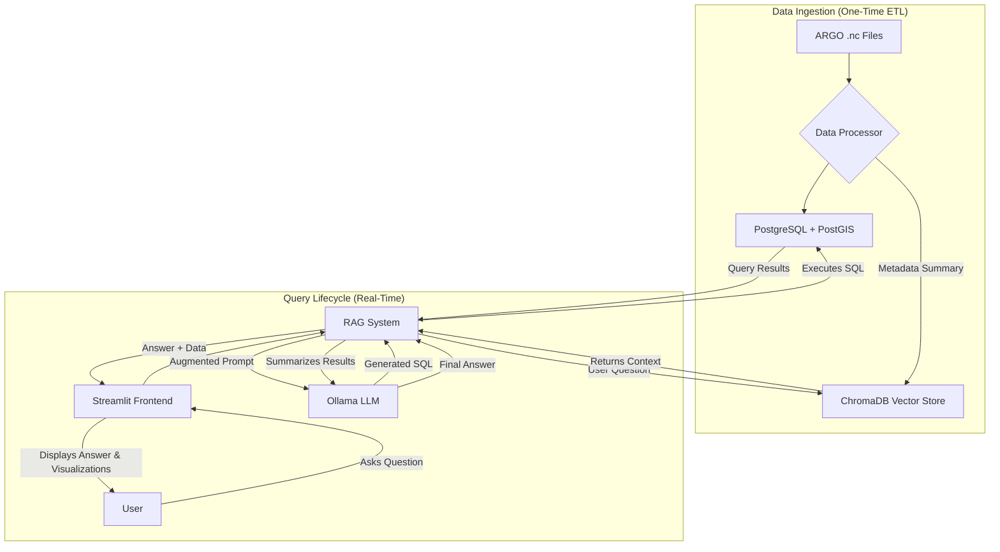

# 🤖 Conversational ARGO Ocean Data Explorer

An AI-powered conversational system for exploring and visualizing ARGO oceanographic data using natural language. This project was developed for the Smart India Hackathon 2025.


## 🌟 Overview

Oceanographic data from sources like the ARGO float program is vast, complex, and stored in formats like NetCDF that are difficult for non-experts to access. This project bridges that gap by providing an intuitive chatbot interface that allows users—from scientists to policymakers—to ask questions in plain English and receive insightful answers, data visualizations, and summaries in real-time.

The system leverages a Retrieval-Augmented Generation (RAG) pipeline, a local Large Language Model (LLM), and a powerful PostGIS-enabled database to translate natural language into precise SQL queries, democratizing access to critical ocean data.

## ✨ Features

* **Natural Language Querying:** Ask complex questions about ocean data in plain English.
* **AI-Powered SQL Generation:** A local LLM (Ollama) translates user questions into executable PostgreSQL queries.
* **Retrieval-Augmented Generation (RAG):** A vector database (ChromaDB) provides the LLM with relevant context about the data, improving query accuracy.
* **Interactive Visualizations:** The Streamlit dashboard automatically generates geospatial maps, depth profiles, and time-series charts based on the query results.
* **Robust Data Pipeline:** Efficiently processes raw ARGO NetCDF files, flattens the complex data, and loads it into a structured database.
* **Geospatial Capabilities:** Powered by PostGIS, the system can answer location-based questions like "What are the nearest floats to this location?".
* **Local & Private:** Runs entirely on your local machine, ensuring data privacy and no dependency on paid APIs.

## 🛠️ Tech Stack

* **Backend:** Python
* **AI Engine:** Ollama (with Llama 3.2)
* **AI Framework:** LangChain
* **Databases:**
    * **Relational:** PostgreSQL + PostGIS (for structured and geospatial data)
    * **Vector:** ChromaDB (for contextual metadata and RAG)
* **Frontend:** Streamlit
* **Data Processing:** xarray, pandas, NumPy
* **Visualizations:** Plotly

## 🏗️ System Architecture

The application is built on a modular architecture that separates data processing from the real-time query lifecycle.



## 🔄 Workflow / Data Flow

### 1. Data Ingestion & Processing
This is the initial setup process that prepares the data for querying.
1.  Raw ARGO NetCDF (`.nc`) files are placed in the `/data` directory.
2.  The `data_processing.py` script is run.
3.  For each file, **xarray** opens and parses the complex, multi-dimensional data.
4.  The script extracts key variables (Temperature, Salinity, Pressure, Time, Location) and flattens them into a tabular format using **pandas**.
5.  This structured data is bulk-inserted into a **PostgreSQL** table named `argo_profiles`. A `GEOMETRY` column is created for fast geospatial lookups.
6.  A concise, natural language summary of each float's metadata (e.g., its ID, project name, and measured parameters) is generated.
7.  This summary is converted into a vector embedding and stored in the **ChromaDB** vector store, creating an index for contextual search.

### 2. Conversational Query Lifecycle
This is what happens every time a user asks a question in the chatbot.
1.  The user types a question into the **Streamlit** interface (e.g., "What are the average temperatures below 500m?").
2.  The question is sent to the **RAG System**.
3.  The RAG system embeds the user's question and queries **ChromaDB** to find metadata of floats that are semantically similar or relevant to the question.
4.  A detailed prompt is constructed containing:
    * Strict rules and examples for writing good SQL.
    * The database schema.
    * The retrieved context from ChromaDB.
    * The user's original question.
5.  This "augmented prompt" is sent to the **Ollama LLM**.
6.  The LLM generates a precise PostgreSQL query based on the prompt.
7.  The RAG system executes this query against the **PostgreSQL** database.
8.  The raw data results are returned.
9.  The results are passed back to the LLM with a final prompt asking it to generate a human-friendly summary.
10. The final summary, along with the raw data, is sent back to the **Streamlit** frontend, which displays the answer, a data table, and interactive visualizations.

## 🚀 Setup and Installation

1.  **Clone the repository:**
    ```bash
    git clone <your-repo-url>
    cd <your-repo-name>
    ```
2.  **Create a virtual environment and install dependencies:**
    ```bash
    python -m venv .venv
    source .venv/bin/activate  # On Windows: .venv\Scripts\activate
    pip install -r requirements.txt
    ```
3.  **Set up PostgreSQL:**
    * Install PostgreSQL.
    * Install the **PostGIS** extension using Stack Builder.
    * Create a new user and database using `psql`:
        ```sql
        CREATE USER argo_user WITH PASSWORD 'your_password';
        CREATE DATABASE argo_db OWNER argo_user;
        \c argo_db
        -- Login as a superuser (e.g., postgres) to run this next command
        CREATE EXTENSION postgis; 
        ```
4.  **Set up AI Engine:**
    * Install and run [Ollama](https://ollama.ai/).
    * Pull the required model: `ollama pull llama3.2`
5.  **Configure the Application:**
    * Update `config.py` with your PostgreSQL credentials and correct Ollama model name, or set the corresponding environment variables.
6.  **Process Data:**
    * Place your ARGO `.nc` files into the `/data` directory.
    * Run the data processing script: `data_processing_verbose.py`

## ▶️ How to Use

1.  Ensure PostgreSQL and Ollama are running.
2.  Launch the Streamlit dashboard:
    ```bash
    streamlit run dashboard.py
    ```
3.  Open the provided URL in your browser and start asking questions!

## 🔮 Future Work

* Add data export functionality to NetCDF and ASCII formats.
* Integrate additional in-situ datasets (BGC, gliders, buoys).
* Extend the pipeline to support satellite datasets.
* Implement a more advanced caching layer for frequently asked questions.
